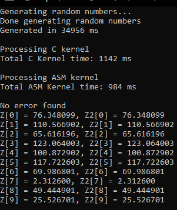

# LBYARCH_MCO2
## Overview
This project implements a mathematical function in C and Assembly (x86-64), and compares the speed at which the two accomplish the calculation task. The mathematical function is calculated as `Z[i] = A * X[i] + Y[i]`, where A is a constant scalar, and X, Y, and Z are all vectors. Vector sizes are 2^20, 24, and 30. Additionally, all values are single precision decimals. 

The comparison methodology was to run each vector size 30 times for both the C kernel/implementation and the x86-64 version, measuring the performance of only the kernels themselves. These values were measured in `ms` and averaged to summarize the data. Additionally, the `Debug` and `Release` build/run options were also compared as part of the assignment. Finally, the C kernel was also used as a sanity check to ensure that the Assembly output was correct.

The project does not allow for any user input. The three vector (array) sizes are tested by simply running the C program (caller) as is. The time for each process was also outputted to corresponding text files.

## General Code Process
- The code first initializes the variables then begins with the first array size of 2^20. 
- Memory is allocated to the arrays X, Y, Z, and Z2 for each iteration of the 30 tests
 - Note that Z was used to store the output of the C kernel, while Z2 stored the output of the x86-64 kernel.
 - F X and Y are filled with randomly generated floating values.
 - Z and Z2 are filled with `0.0's` to avoid garbage values. 
 - This was also timed for the curiosity of the developers, but the measurement plays no significant role in the actual output.
- Next, the arrays were passed to the C kernel, and the mathematical function mentioned earlier was calculated for and timed.
- Similarly, the arrays were then passed to the x86-64 kernel and timed.
- Z and Z2 are compared for errors, and any errors are flagged.
- If there are no errors, the first 10 outputs of both arrays are printed together.
- Finally, all the time data is written into a file.
Then this process is repeated for the other sizes.

## Usage

## Outputs
1. Comparative execution time and analysis of the performance of the kernels
### General Comments
When the math function is implemented as-is in Assembly, i.e. passing each value one-by-one instead of the entire array, the Assembly turned out to always be slower. This turns out to be an inefficient solution because...

### Debug Mode
In debug more, the Assembly kernel trounced over its C counterpart. This makes sense, as discussed in class, Assembly should theoretically be faster since it is a low level language. It does not need a compiler, hence eliminating the overhead from compilation. Assembly can be quickly converted to machine code, and there are possible optimizations which are possible only at a lower level, hence the speed of Assembly.

To add, debug mode also adds some overhead for the C code as a whole. It's more "careful" and "lenient" with mistakes, sometimes even allowing them, which impacts performance. Other than that is, again, having to pass through a compiler first before the hardware can understand what the high-level language wants.

### Release Mode
However, in Release, the C code pulled ahead slightly in all array size cases. This is most likely because release mode uses all possible optimizations available to the C kernel, sometimes even causing memory leaks which we experienced due to a mistake in our Assembly kernel. 

To briefly explain it, each iteration in the 30 runs was slowly using more and more memory. This was not the case in debug mode, which had used a more-or-less constant amount of memory throughout each array size. 

2. Screenshot of program output with the correctness check (C)
3. Screenshot of program output with the correctness check (x86-64)
**NOTE: Z represents the *C* output; Z2 represents the *x86-64* output.**
| Sample outputs (combined C and x86-64) | | |
| --- | --- | ---- |
|  | | |