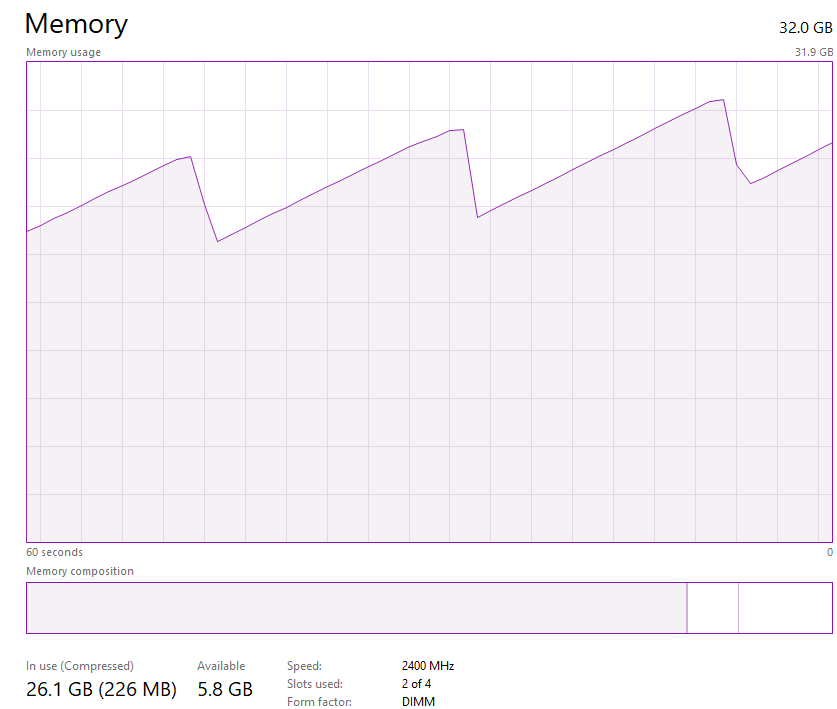
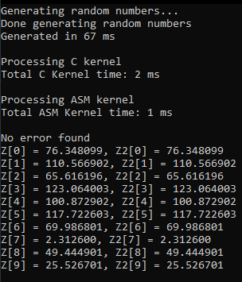
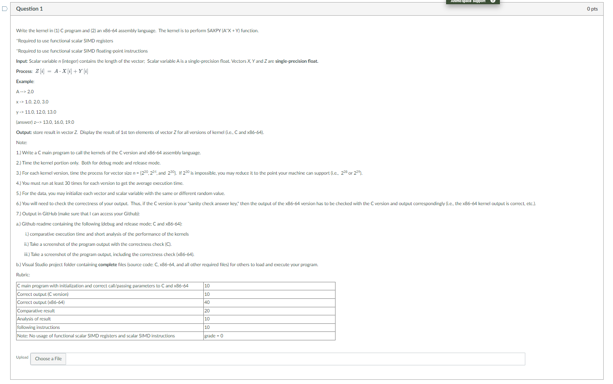

# LBYARCH_MCO2
## Overview
*A screenshot of the specifications is available at the end of the README, [here.](https://github.com/fir3yice/LBYARCH_MCO2?tab=readme-ov-file#others)*

*Jump to the outputs [here.](https://github.com/fir3yice/LBYARCH_MCO2?tab=readme-ov-file#outputs)*

This project implements a mathematical function in C and Assembly (x86-64), and compares the speed at which the two accomplish the calculation task. The mathematical function is calculated as `Z[i] = A * X[i] + Y[i]`, where A is a constant scalar, and X, Y, and Z are all vectors. Vector sizes are 220, 224, and 230. Additionally, all values are single precision decimals. 

The comparison methodology was to run each vector size 30 times for both the C kernel/implementation and the x86-64 version, measuring the performance of only the kernels themselves. These values were measured in `ms` and averaged to summarize the data. Additionally, the `Debug` and `Release` build/run options were also compared as part of the assignment. Finally, the C kernel was also used as a sanity check to ensure that the Assembly output was correct.

The project does not allow for any user input. The three vector (array) sizes are tested by simply running the C program (caller) as is. The time for each process was also outputted to corresponding text files.

## How to run?
- Clone the entire repo
- Open the `.sln` named `LABYARCH_MCO2.sln` in Visual Studio
- In VS, navigate to `/Source Files`, then `mco2.c`
- Compile and run under Debug or Release
- NOTE: the `.nasm` file is built under the programmer's local storage (ie, `C:\nasm\nasm -f win64 asmfunc.asm` and outputting `asmfunc.obj`). The execution path may need changing depending on the storage set-up.

## General Code Process
- The code first initializes the variables then begins with the first array size of 220. 
- Memory is allocated to the arrays X, Y, Z, and Z2 for each iteration of the 30 tests
 - Note that Z was used to store the output of the C kernel, while Z2 stored the output of the x86-64 kernel.
 - F X and Y are filled with randomly generated floating values.
 - Z and Z2 are filled with `0.0's` to avoid garbage values. 
 - This was also timed for the curiosity of the developers, but the measurement plays no significant role in the actual output.
- Next, the arrays were passed to the C kernel, and the mathematical function mentioned earlier was calculated for and timed.
- Similarly, the arrays were then passed to the x86-64 kernel and timed.
- Z and Z2 are compared for errors, and any errors are flagged.
- If there are no errors, the first 10 outputs of both arrays are printed together.
- Finally, all the time data is written into a file.
Then this process is repeated for the other array sizes (looped automatically)

## Outputs
*The consolidated data is fully available [here in this repo.](LBYARCH_MCO2/Compiled_Data.xlsx) Individual text files are also available in [here](</LBYARCH_MCO2>).*

*Screenshots [Debug Data](images/Debug_Data.png); [Release Data](images/Release_Data.png)*

Note: The 2nd column in the C files is the correct flag. 1 indicates that all the ASM kernel's calculations match that of the C kernel and are correct.

[Back to top](https://github.com/fir3yice/LBYARCH_MCO2?tab=readme-ov-file#overview)

### 1. Comparative execution time and analysis of the performance of the kernels
#### General Comments (Non-Final versions)
When the math function is implemented as-is in Assembly, i.e. passing each value one-by-one instead of the entire array, the Assembly turned out to always be slower. This turns out to be an inefficient solution because passing the values one-by-one most likely takes more time and computation (retrieving the value then passing in C) compared to just passing the entire array (its reference), then accessing the memory directly in assembly. The loop being in C also adds some extra overhead, hence the slower Assembly kernel in this version of the project.

#### Debug Mode
After averaging the run times, the averages for the Assembly kernel in 220, 224, and 230, was calculated to be 0.70ms, 13.47ms, and 901.93ms respectively. Meanwhile, the averages for the C kernel were 2.0ms, 32.57ms, and 2301.67ms respectively. The percent differences between the averages are also shown to provide more context on how much faster and slower one kernel was over the other. Note that the original values of the averages were used to calculate for the percent values.

|Summary of Averages in ms | 220 | 224 | 230 |
|---|----| ----|----|
|ASM| 0.7 | 13.47 | 901.93 |
|C| 2 | 32.57 | 2301.67 |
|ASM ***faster*** by| 65.00% | 58.65% | 60.81% |
|C ***slower*** by | 185.71% | 141.83% | 155.19% |

In debug mode, the Assembly kernel trounced over its C counterpart and was faster by around 60% in all array sizes. This makes sense, as discussed in class, Assembly should theoretically be faster since it is a low level language. It does not need a compiler, hence eliminating the overhead from compilation. Assembly can be quickly converted to machine code, and there are possible optimizations which are possible only at a lower level, hence the speed of Assembly.

To add, debug mode also adds some overhead for the C code as a whole. It's more "careful" and "lenient" with mistakes, sometimes even allowing them, which impacts performance. Other than that is, again, C having to pass through a compiler first before the hardware can understand what the high-level language wants, thus adding more overhead and increasing execution time.

#### Release Mode
Meanwhile, the averages for Release were calculated to be 0.7ms, 13.2ms, and 832.5 for Assembly, and 0.57ms, 11.23ms, and 752.13ms for C. This summary is shown in the table below.
|Summary of Averages in ms | 220 | 224 | 230 |
|---|----| ----|----|
|ASM| 0.7 | 13.2 | 832.5 |
|C| 0.57 | 11.23 | 752.13 |
|ASM ***slower*** by| 19.05% | 14.90% | 9.65% |
|C ***faster*** by | 23.53% | 17.51% | 10.69% |

As can be seen, in Release mode, the C code pulled ahead slightly in all array size cases. This is most likely because release mode uses all possible optimizations available to the C code and kernel. This can also be seen in the array generation taking as much less time in release compared to debug. 
The evidence of optimization being turned on can be seen when checking the Project Properties's C/C++ tab, then going to Optimization under the Debug and Release configurations. By default, as shown below, Debug has all C optimizations turned off, while Release has a few turned on, such as Whole Program Optimization and generally "Favoring Speed." Given the project specifications - specifically nothing explicitly stating to 'turn off the optimizations on Release,' the project was tested with the default settings. (Note: We assumed that this was the intention in the first place.)

| Configuration | |
| --- | --- |
| Debug |  |
|Release |  |

That said, all of these optimizations done by Visual Studio sometimes even causing memory leaks which we experienced due to a mistake in our Assembly kernel. To briefly explain it, each iteration in the 30 runs was slowly using more and more memory. This was not the case in debug mode, which had used a more-or-less constant amount of memory throughout each array size. It turned out to be a mistake in the Assembly kernel, but it was interesting that our computers' memory was slowly being filled without ever getting fully released. A screenshot of this happening, as seen in task manager, is shown below.

Left: Each iteration taking more memory. Right: Memory released after stopping the test (since the PC began to slow down).

 

### 2. Screenshot of program output with the correctness check (C), 3. Screenshot of program output with the correctness check (x86-64)
Some sample outputs of the program running are shown below.
**NOTE: Z represents the *C* output; Z2 represents the *x86-64* output.**

| Debug Mode Sample outputs | (combined C and x86-64) |
| --- | --- |
| Array Size = 220 | |
|  |  |
| Array Size = 224 | |
|  |  |
| Array Size = 230 | |
|  |  |

| Release Mode Sample outputs | (combined C and x86-64) |
| --- | --- |
| Array Size = 220 | |
|  |  |
| Array Size = 224 | |
|  |  |
| Array Size = 230 | |
|  |  |

## Others
Screenshot of Project Specifications

[Back to top](https://github.com/fir3yice/LBYARCH_MCO2?tab=readme-ov-file#overview)